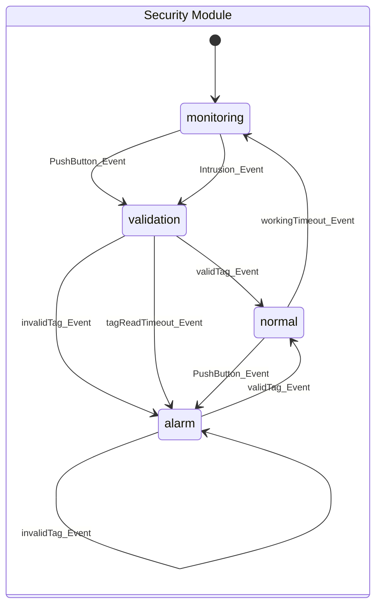

## Estados y Eventos

### SEC_MONITORING_STATE && INTRUSION_DETECTED_EVENT
- Estando en el estado monitor y se recibe el evento "intrusión detectada", que fue generada por la activacion del sensor PIR.
- Se ejecuta la acción de disparar el temporizador de lectura de un Tag RFID. 
- Se transiciona al estado de validación. 
- Sería necesario disponer de un hook a un callback para que otro módulo pueda recibir la información de una intrusión.

### SEC_MONITORING_STATE && PANIC_BUTTON_PRESSED_EVENT
- Estando en el estado monitor y se recibe el evento "botón de pánico activado", que fue generada por la activacion de presionar un botón con retención.
- Se ejecuta la acción de disparar el temporizador de lectura de un Tag RFID. 
- Se transiciona al estado de validación. 
- Sería necesario disponer de un hook a un callback para que otro módulo pueda recibir la información que el botón de pánico fue activado.

### SEC_VALIDATION_STATE && VALID_TAG_EVENT
- Estando en el estado de validacion y se recibe el evento de lectura de un tag RFID válido.
- Se ejecuta la acción de disparar el temporizador de trabajo en marcha.
- Se transiciona al estado normal.
- Sería necesario disponer de un hook a un callback para que otro módulo pueda recibir la información que hay personal autorizado trabajando en la estación

### SEC_VALIDATION_STATE && INVALID_TAG_EVENT
- Estando en el estado validacion y se recibe el evento de lectura de un tag RFID inválido.
- Se ejecuta la acción de disparar las luces y la sirena.
- Se transiciona al estado de alarma.
- Sería necesario disponer de un hook a un callback para que otro módulo pueda recibir la información que hay una intrusión.

### SEC_VALIDATION_STATE && READ_TAG_TIMEOUT_EVENT
- Estando en el estado de validación se recibe un timeout de lectura de un Tag RFID.
- No se toma ninguna acción.
- Se transiciona al estado de alarma.
- Sería necesario disponer de un hook a un callback para que otro módulo pueda recibir la información que ocurrio una intrución por personal no autorizado.

### SEC_ALARM_STATE && VALID_TAG_EVENT
-
-
-  Se transiciona al estado normal.
-

### SEC_ALARM_STATE && INVALID_TAG_EVENT
-
-
- Se mantiene en el estado de alarma.
-

### SEC_NORMAL_STATE && WORKING_TIMEOUT_EVENT
- Estando en el estado normal y se recibe el evento de timeout de trabajo
- No se toma ninguna acción.
- Se transiciona al estado monitor
- Sería necesario disponer de un hook a un callback para que otro módulo pueda recibir la información que el sistema queda solo y detectando intentos de intrusión.

### SEC_NORMAL_STATE && PANIC_BUTTON_PRESSED_EVENT
- Estando en estado normal y se recibe el evento de "botón de pánico activado", que fue generada por la activacion de presionar un botón con retención.
- No se toman acciones.
- Se mantiene en el estado normal. 
- Sería necesario disponer de un hook a un callback para que otro módulo pueda recibir la información que el botón de pánico fue activado. (Alarma silenciosa, solo se envia informacion a entidad superior)