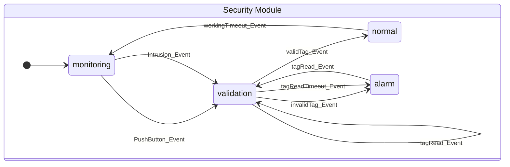

```mermaid
%%{init: { "themeVariables": { "edgeLabelBackground": "#FFF3CD0F" } }}%%
%%{init:{ "themeCSS": ".edgeLabel{font-size:12px}" }}%%

stateDiagram-v2
    secMod : Security Module
    state secMod 
    {
        direction LR
        state1 : monitoring
        state2 : validation
        state3 : alarm
        state4 : normal

        [*] --> state1
        state1 --> state2 : PushButton_Event
        state1 --> state2 : Intrusion_Event
        state2 --> state4 : validTag_Event
        state3 --> state2 : tagRead_Event        
        state2 --> state3 : invalidTag_Event
        state2 --> state3 : tagReadTimeout_Event
        state2 --> state2 : tagRead_Event
        state4 --> state1 : workingTimeout_Event
    }
```